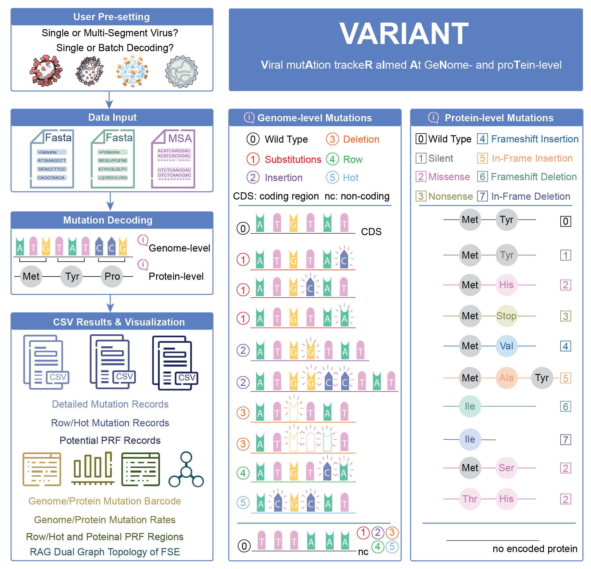

# VARIANT: Viral mutAtion trackeR aImed At GeNome and proTein-level

A comprehensive Python framework for viral mutation analysis across single-segment and multi-segment viruses, VARIANT automates the full pipeline from nucleotide changes to protein-level consequences, including substitutions, insertions, deletions, missense, nonsense, and frameshift mutations, while also identifying biologically meaningful row mutations, hot mutations, and potential programmed ribosomal frameshifting (PRF) regions; in addition, it incorporates RNA dual-graph topology analysis from dot-bracket structures to enable structural comparison of frameshifting elements across viral lineages.



## Features

- **Multi-virus support**: SARS-CoV-2, ZaireEbola, Chikungunya, HIV-1, H3N2, and easily extensible to other viruses
- **Multi-segment virus support**: Automatic structure detection (e.g., H3N2 influenza)
- **Comprehensive mutation analysis**: Point mutations, insertions, deletions, row and hot mutations
- **Advanced mutation classification**: Missense, nonsense, silent, and frameshift mutations
- **Protein-level impact analysis**: Amino acid changes with biological significance
- **Automatic mutation summary generation**: No manual flags required
- **Complex protein coordinate handling**: Support `join()` coordinates for viral polyproteins
- **Programmed Ribosomal Frameshifting (PRF) detection** (+1/-1 frameshifting)
- **RNA Dual Graph topology assignment** from dot-bracket RNA secondary structures
- **Structured output**: Text and CSV formats for analysis and visualization
- **Configurable per-virus settings**: Easy setup for new viruses
## Supported Viruses

VARIANT includes the following five viruses as built-in examples:

| **Virus** | **Type** | **Key Proteins** |
|-----------|----------|------------------|
| **SARS-CoV-2** | Single-segment | RNA-dependent-polymerase, spike, nucleocapsid |
| **ZaireEbola** | Single-segment | Nucleoprotein, polymerase, spike glycoprotein |
| **Chikungunya** | Single-segment | nsP1-4, capsid, E1/E2/E3, 6K proteins |
| **HIV-1** | Single-segment | Pr55(Gag), reverse transcriptase, integrase, envelope |
| **H3N2** | Multi-segment (8) | PB1/PB2/PA, hemagglutinin, neuraminidase, matrix |

Users can also upload and analyze customized viruses with their own reference genome, proteome, and MSA files.

### Analysis Capabilities
- **Genome support and modes**: Support both single-segment and multi-segment viral genomes, with single-sample and batch decoding modes.
- **Input and pre-configuration**: Use user pre-configuration with reference genome and proteome sequences (FASTA) plus aligned viral genomes (MSA).
- **Genome- and protein-level decoding**: Perform mutation decoding at nucleotide and amino acid resolution.
- **Mutation classes**: Detect substitutions, insertions, deletions, row mutations (consecutive substitutions within a 3-nt window), and hot mutations (two non-consecutive substitutions within a 3-nt window).
- **Frameshift and RNA topology analysis**: Identify potential programmed ribosomal frameshift (PRF) signals and classify frameshifting-element RNA secondary structures with dual graph topology analysis using the RNA-As-Graphs framework.
- **Outputs and visualization**: Produce structured CSV outputs (detailed mutation records, row/hot mutation sites, potential PRF regions) and provide mutation distribution and classification visualizations, including genome-level categories and corresponding protein-level consequences.

## Installation

VARIANT supports two local installation paths: a conda-managed environment (`conda env create -f environment.yaml`) and editable pip installation (`pip install -e .`). Use `conda` if you want an isolated bioinformatics environment with managed native dependencies, or use the `pip` workflow if you prefer package-style CLI usage.

### Option 1: Conda Environment

**Prerequisites**: Conda or Miniconda installed

```bash
# Clone the repository
git clone https://github.com/wangru25/VARIANT.git
cd VARIANT

# Create and activate conda environment
conda env create -f environment.yaml
conda activate variant

# Make scripts executable (if needed)
chmod +x main.py

# Verify installation
python main.py --help
```

### Option 2: CLI Installation

**Prerequisites**: Python 3.8 or higher

```bash
# Clone the repository
git clone https://github.com/wangru25/VARIANT.git
cd VARIANT

# Install the package and dependencies
pip install -e .

# Verify installation
variant --help
```

### *Dependencies*
- BioPython >= 1.79
- NumPy >= 1.21.0  
- pandas >= 1.3.0
- PyYAML >= 6.0
- fuzzysearch == 0.7.3
- more-itertools >= 8.12.0
- Plotly >= 6.1.1
- Kaleido >= 1.0.0
- matplotlib >= 3.5.0
- seaborn >= 0.11.0
- ViennaRNA >= 2.4.0 (for PRF scanning and RNA structure prediction)
- python-igraph >= 0.11.8 (for RNA dual-graph assignment)
- NetworkX >= 3.1 (for graph rendering utilities)

## Usage & Quick Start Examples

### Option 1: Conda Usage (Recommended)

After `conda activate variant`, users can implement functions with different input arguments:

```bash
# Show available options
python main.py --help

# Analyze specific genome
python main.py --virus SARS-CoV-2 --genome-id EPI_ISL_16327572

# Process all genomes in MSA (automatically generates mutation summaries)
python main.py --virus SARS-CoV-2 --process-all

# PRF analysis
python main.py --virus SARS-CoV-2 --detect-frameshifts

# Multi-segment virus analysis (processes all segments)
python main.py --virus H3N2 --process-all

# Specific segment analysis
python main.py --virus H3N2 --segment segment_1 --process-all

# List available built-in and custom viruses
python main.py --list-viruses
```

#### *Input Arguments*

- `--virus`: Name of the virus to analyze
- `--genome-id`: Specific genome ID to process
- `--process-all`: Process all genomes in the MSA file (automatically generates mutation summaries)
- `--segment`: For multi-segment viruses, specify segment to analyze
- `--detect-frameshifts`: Detect potential frameshifting sites (PRF analysis only)
- `--msa-file`: Custom MSA file path
- `--config`: Custom configuration file path

### Option 2: CLI Usage

After `pip install -e .`, `variant` will be created. Users can choose to either `setup`, `analyze`, or perform `prf` with different arguments:

```bash
# Show all available commands
variant --help

# Dataset Setup
variant setup --virus SARS-CoV-2 --config virus_config.yaml
variant setup --virus HIV-1

# Mutation Analysis
variant analyze --virus SARS-CoV-2 --msa data/SARS-CoV-2/clustalW/test_msa_2.txt

# PRF Analysis
variant prf --genome data/SARS-CoV-2/refs/NC_045512.fasta --output results.csv
```

#### *Input Arguments*
- `setup`: Set up the environment according to the config file
- `analyze`: Perform mutation analysis
- `prf`: Perform PRF analysis
- `--virus`: Name of the virus to analyze
- `--config`: Custom configuration file path
- `--msa`: Custom MSA file path
- `--genome`: Sequence of specific genome to process
- `--output`: Output directory

## Output Files

The downloadable results are under the default output directory `result/<Virus>/`:
- Single-segment viruses: `result/<Virus>/`
- Multi-segment viruses: `result/<Virus>/<Segment>/`

Per each genome, the results are provided with corresponding `GenomeID`:
- `<GenomeID>.txt` — detailed mutation report
- `<GenomeID>_mutation_summary.csv` — mutation summary table
- `<GenomeID>_row_hot_mutations.csv` — row/hot mutation table (generated only when row/hot mutations are detected)


## PRF Scanner

VARIANT supports PRF candidate detection through the main pipeline.

### Usage
```bash
python main.py --virus SARS-CoV-2 --detect-frameshifts
python main.py --virus SARS-CoV-2 --process-all --detect-frameshifts
```

### Output Files
PRF outputs are provided under `result/<Virus>/` (or `result/<Virus>/<Segment>/` for multi-segment viruses):
- `*.prf_candidates.csv` — candidate PRF sites with sequence/structure context
- `*.prf_candidates.bed` — genomic coordinates for downstream browser/track usage

## RNA Dual Graph (Local Code Workflow)

If you want to use VARIANT as a local research codebase (without `web_app.py`), the RNA dual-graph pipeline is available under `Existing-Dual-Search/`.

### Input
- Dot-bracket structure input (`.dbn`) with:
  - sequence header (`>ID`)
  - RNA sequence
  - dot-bracket structure

### Pipeline
1. Dot-bracket to DSSR-like intermediate (`convert_dbn_to_dssr.py`)
2. DSSR to CT conversion (`PDBto2D.py`)
3. Dual graph assignment (`Dual_Library.py`, `dualGraphs.py`, `ClassesFunctions.py`)

### Notes
- Keep the `Existing-Dual-Search` folder intact when running locally.
- `environment.yaml` includes graph dependencies used by dual-graph functionality.
- See `Existing-Dual-Search/README.md` and `Existing-Dual-Search/GUIDE.md` for step-by-step examples and expected formats.


## Visualization

VARIANT plotting is driven from the repository root by `plot.py`, which delegates to `src/visualization/`:

1. `plot.py` — unified CLI (set `--type` to `mutation`, `row-hot`, or `prf`) for integrated figures.
2. `src/visualization/figure1_mutation_analysis.py` — combined genome and protein mutation analysis.
3. `src/visualization/figure2_row_hot_mutations.py` — row and hot-mutation views.
4. `src/visualization/figure3_PRF.py` — PRF region visualization from candidate PRF result files.

Figures are given as HTML and PDF under `imgs/visualizations/<Virus>/` (unless `--output` overrides the path).

```bash
python plot.py --list-viruses
python plot.py --type mutation --virus SARS-CoV-2 --genome-id EPI_ISL_123456
python plot.py --type row-hot --virus SARS-CoV-2
python plot.py --type prf --virus SARS-CoV-2
python src/visualization/figure3_PRF.py --help
```


## Adding New Viruses

### Quick Setup (Recommended)

Use the setup script for easy virus configuration:

```bash
# Add virus to configuration
python scripts/setup_virus_dataset.py --add-virus "MyVirus" --reference "my_ref.fasta"

# Set up complete dataset
python scripts/setup_virus_dataset.py --setup "MyVirus" \
    --reference-path "/path/to/your/reference.fasta" \
    --proteome-path "/path/to/your/proteome.fasta" \
    --msa-files "/path/to/msa1.txt,/path/to/msa2.txt"

# Validate setup
python scripts/setup_virus_dataset.py --validate "MyVirus"
```

### Manual Setup

1. Create directory structure:
   ```bash
   # For single-segment virus
   mkdir -p data/NewVirus/{clustalW,refs,fasta}
   mkdir -p result/NewVirus
   
   # For multi-segment virus
   for i in {1..N}; do
     mkdir -p data/NewVirus/segment_$i/{clustalW,refs,fasta}
     mkdir -p result/NewVirus/segment_$i
   done
   ```

2. Add configuration to `virus_config.yaml`:
   ```yaml
   viruses:
     NewVirus:
       reference_genome: "my_ref.fasta"
       proteome_file: "my_proteome.fasta"
       codon_table_id: 1
       description: "My custom virus"
       default_msa_file: "my_msa.txt"
   ```

3. Place your files:
   ```bash
   # Copy reference genome
   cp /path/to/your/reference.fasta data/NewVirus/refs/my_ref.fasta
   
   # Copy proteome file
   cp /path/to/your/proteome.fasta data/NewVirus/refs/my_proteome.fasta
   
   # Copy MSA files
   cp /path/to/your/msa*.txt data/NewVirus/clustalW/
   ```

### File Requirements

#### Reference Genome File (Required)
- **Format**: FASTA format
- **Content**: Complete reference genome sequence
- **Example** (SARS-CoV-2 reference): [SARS-CoV-2 genome reference sequence](data/SARS-CoV-2/refs/NC_045512.fasta)

#### Proteome File (Required)
- **Format**: FASTA format
- **Content**: Protein sequences with headers
- **Example** (SARS-CoV-2 proteome reference): [SARS-CoV-2 proteome reference sequence](data/SARS-CoV-2/refs/SARS-CoV-2_proteome.fasta)

#### MSA File (Required)
- **Format**: Text file with aligned nucleotide genome sequences
- **Content**: Multiple aligned genome sequences, typically generated from [Clustal Omega](https://www.ebi.ac.uk/jdispatcher/msa/clustalo) using genome FASTA input. The input file is [SARS-CoV-2 all variants sequences](data/SARS-CoV-2/fasta/sequences_w_reference.fasta)
- **Example** (SARS-CoV-2 MSA): [SARS-CoV-2 MSA](data/SARS-CoV-2/clustalW/gisaid_hcov-19_20221201_20221230_China_0_msa.txt)

#### Variants Sequences File (Optional)
- **Format**: FASTA format
- **Content**: Reference genome sequence together with other variant genome sequences that user want to be decoded
- **Example** (SARS-CoV-2 proteome reference): [SARS-CoV-2 all variants sequences](data/SARS-CoV-2/fasta/sequences_w_reference.fasta)

<!-- ### Codon Table IDs

Different organisms use different genetic codes:

- **1**: Standard genetic code (most viruses, bacteria, eukaryotes)
- **2**: Vertebrate mitochondrial code
- **3**: Yeast mitochondrial code
- **4**: Mold, protozoan, and coelenterate mitochondrial code
- **5**: Invertebrate mitochondrial code
- **6**: Ciliate, dasycladacean and hexamita nuclear code
- **9**: Echinoderm and flatworm mitochondrial code
- **10**: Euplotid nuclear code
- **11**: Bacterial, archaeal and plant plastid code
- **12**: Alternative yeast nuclear code
- **13**: Ascidian mitochondrial code
- **14**: Alternative flatworm mitochondrial code
- **16**: Chlorophycean mitochondrial code
- **21**: Trematode mitochondrial code
- **22**: Scenedesmus obliquus mitochondrial code
- **23**: Thraustochytrium mitochondrial code
- **24**: Pterobranchia mitochondrial code
- **25**: Candidate division SR1 and gracilibacteria code
- **26**: Pachysolen tannophilus nuclear code
- **27**: Karyorelict nuclear code
- **28**: Condylostoma nuclear code
- **29**: Mesodinium nuclear code
- **30**: Peritrich nuclear code
- **31**: Blastocrithidia nuclear code
- **33**: Cephalodiscidae mitochondrial code -->

### Example Setup

#### Example 1: Adding HIV Dataset
```bash
# 1. Add HIV to configuration
python scripts/setup_virus_dataset.py --add-virus "HIV" \
    --reference "HIV_reference.fasta" \
    --proteome "HIV_proteome.fasta" \
    --description "Human Immunodeficiency Virus"

# 2. Set up dataset with files
python scripts/setup_virus_dataset.py --setup "HIV" \
    --reference-path "/path/to/HIV_reference.fasta" \
    --proteome-path "/path/to/HIV_proteome.fasta" \
    --msa-files "/path/to/hiv_msa1.txt,/path/to/hiv_msa2.txt"

# 3. Run analysis
python main.py --virus HIV --process-all
```

#### Example 2: Manual Setup
```bash
# 1. Create directories
mkdir -p data/MyCustomVirus/{clustalW,refs,fasta}
mkdir -p result/MyCustomVirus

# 2. Add to virus_config.yaml
# Add the configuration shown above

# 3. Copy files
cp /path/to/reference.fasta data/MyCustomVirus/refs/my_ref.fasta
cp /path/to/proteome.fasta data/MyCustomVirus/refs/my_proteome.fasta
cp /path/to/msa.txt data/MyCustomVirus/clustalW/

# 4. Run analysis
python main.py --virus MyCustomVirus --genome-id GENOME_ID
```

## Troubleshooting

### Common Issues

1. **"Virus not found in configuration"**
   ```bash
   # Add the virus to configuration
   python scripts/setup_virus_dataset.py --add-virus "MyVirus" --reference "my_ref.fasta"
   ```

2. **"MSA file not found"**
   ```bash
   # Check available files
   ls data/MyVirus/clustalW/
   
   # Use a specific MSA file
   python main.py --virus MyVirus --msa-file my_msa.txt
   ```

3. **"Reference genome file not found"**
   ```bash
   # Check if file exists
   ls data/MyVirus/refs/
   
   # Copy your reference file
   cp /path/to/your/reference.fasta data/MyVirus/refs/my_ref.fasta
   ```

4. **"Proteome file not found"**
   - This is a warning, not an error
   - Analysis will continue with genome-level mutations only
   - Protein mutation analysis will be skipped

5. **"Multi-segment Processing Issues"**
   - Verify segment directory structure
   - Check segment-specific configurations
   - Ensure all required files exist for each segment

6. **"PRF Detection Issues"**
   - Verify reference genome is in DNA format (ATGC, not AUGC)
   - Check that MSA file contains the reference sequence
   - Ensure proper directory structure for virus data

### Validation

```bash
# Validate your dataset
python scripts/setup_virus_dataset.py --validate "MyVirus"

# List all configured viruses
python main.py --list-viruses

# Check file structure
tree data/MyVirus/
```

### Getting Help

```bash
# Setup script help
python scripts/setup_virus_dataset.py --help

# Main script help
python main.py --help

# List available viruses
python main.py --list-viruses
```

## Citation

If you use this software in your research, please cite:

```bibtex
@software{wang2026variant,
  title={VARIANT: Web Server for Decoding and Analyzing
Viral Mutations at Genome and Protein Levels},
  author={Wang, Rui and Dai, Xuhang and Cao, Xin and Yin, Changchuan and Schlick, Tamar and Wei, Guo-Wei},
  year={2026},
  url={https://github.com/wangru25/VARIANT}
}
```

## Contact

- Author: [Rui Wang](https://github.com/wangru25), [Xuhang Dai](https://github.com/XDaiNYU), [Xin Cao](https://github.com/xincao21), [ChangChuan Yin](https://github.com/cyinbox), [Tamar Schlick](https://github.com/Schlicklab), [Guo-Wei Wei](https://github.com/msuweilab)
- Email: rw3594@nyu.edu
- Institution: New York University
